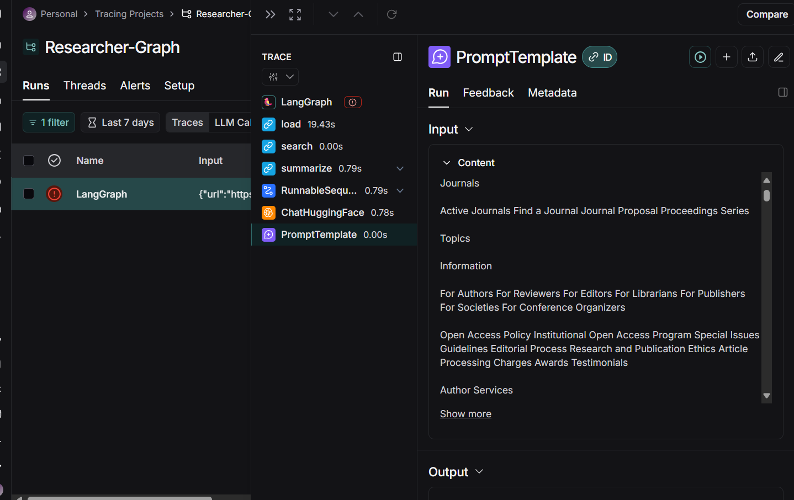

## **The Agentic Research Abstract generator and Web Content Summariser Agent With Langraph**

The project is builton the use of LangGraph approach as a solution for building Agentic AI foor users with the use of Large Language Models (LLMs) and prompt engineering to create a research agent that gives you web content summaries via the Langchain SeleniumURLLoader tool and the generation of captivating abstracts based on the category and title you have prompted the model.

### **How the project goes**
- All files can only work after installing all dependencies in the `environment.yml` file
- The `notebooks folder` contains the jupyter notebook file for testing the project as a whole and for experimenting. `research_graph2.ipynb` contains the experimentation for abstract generation while `research_graph3.ipynb` contains the experimentation for web content summarisation.
- The `graph_article` folder contains the critic, writer and graph_article python files. The `writer.py`(writer agent) file takes the category and title needed for drafting the abstract while the `critic.py` (reviewer agent) reviews the generated abstract. The `graph_article.py` connects boths `writer.py`and `critic.py` by using LangGraph.
- The graph_web folder contains the grap_web, loader, search and summarizer python files. The `search.py` (search agent) file searches takes in the URL link for web search, while the `loader.py` (loader agent) loads the web page but limits it to appoximately 32,000 tokens to not exceed the max token limit. The summarizer agent in `summarizer.py` files, provides a concise summary for the the URL given. The graph_web.py connects all components together as one.
- The utils folder contains the `visualizer.py` file which creates the graphs of the `grah_web.py` and `graph_article.py` files when called in `main.py`. The generatd graphs are saved to the visuals folder.
- The `shared.py` file contains the shared state for the summarizer and abstract generator graphs.
- The `main.py` file calls all graphs together and prompts the user for if the would like to generate an abstract or summarise a webpage.
- The img folder contains the images used for visualisation, also `Langsmith_run.png` show the an example run when Langsmith is used for tracing the graph.

### **Replicating this project**
Before installing the dependencies in the `environment.yml` file. Kindly do the following first
- Download and install &nbsp;[Anaconda](https://www.anaconda.com/products/distribution#Downloads)
    - Once Conda is installed, open your CMD and run the following command `C:/Users/your_system_name/anaconda3/Scripts/activate`
    - Should see something like `'(anaconda3)'C:\Users\your_system_name\Desktop\>` as an output in your CMD
        > NB: Do not close the CMD terminal, would be needed later on 
- Sigup for LangSmith &nbsp;[LangSmith](https://smith.langchain.com/)
    - Once your account is created,  navigate to Tracing projects and create a new project and name it `Researcher-Graph` and copy the API key, also follow the instructions given on the plaform too. **BE SURE TO COPY IT** 

- Sign up for Hugging face (Access to models) &nbsp;[Huggingface](https://huggingface.co/)
    - Once your account is created, navigate to access tokens and create an access token of `read only`. **BE SURE TO COPY YOUR ACCESS TOKEN** 

### **Creating your virtual environment**
- Navigate to your desktop and create a new folder called `research_agent` and paste the `environment.yml` file into the folder
- On your cmd navigate into the `research_graph` folder using `cd research_agent`
- Run `conda env create -f environment.yml -p ../research_agent/research_graph` on your cmd 
- Run `conda env list` on your cmd to list all environments created using Anaconda
- Run `conda activate C:\Users\your_system_name\Desktop\research_agent\research_graph` on your cmd to activate the environment
    - Should see something like `'(research_graph)'C:\Users\your_system_name\Desktop\research_agent>` as an output in your CMD
- Run `conda list`  on your cmd to check if all dependencies have been installed

### **Running your research assistant**
- Paste all your tokens and needed configuration for LanngSmith in the .env file
- Activate your conda environment as previously shown
    - `'(anaconda3)'C:\Users\your_system_name\Desktop\>`
    - `conda activate C:\Users\your_system_name\Desktop\research_agent\research_graph`
- Navigate to the folder of your project; `research_agent` using `cd  research_agent` and run `main.py` for the project to start running

For example prompts, refer to prompts.md

### **Example Usage**
When `main.py` is ran, the graph would be run and the user will be prompted to navigate to their desired use case.

Here is the Publication on;
- [ReadyTensor](https://app.readytensor.ai/publications/research-assistant-LstceSnb3IDH)

### **Issues faced**:
- Trying to tie everything together using LangGraph and make it modular. I believe it could be easily done better using Crew.ai which is dedicated to agents orchestration. (which should be explored)
- Exceeded the monthly limit with Huggingface inference point due to being on the free subscription plan. A pro plan should be used for further testing or use Ollama?
- URLs passed needs to be websites without authentication, I recommend using mdpi.com for researc articles.